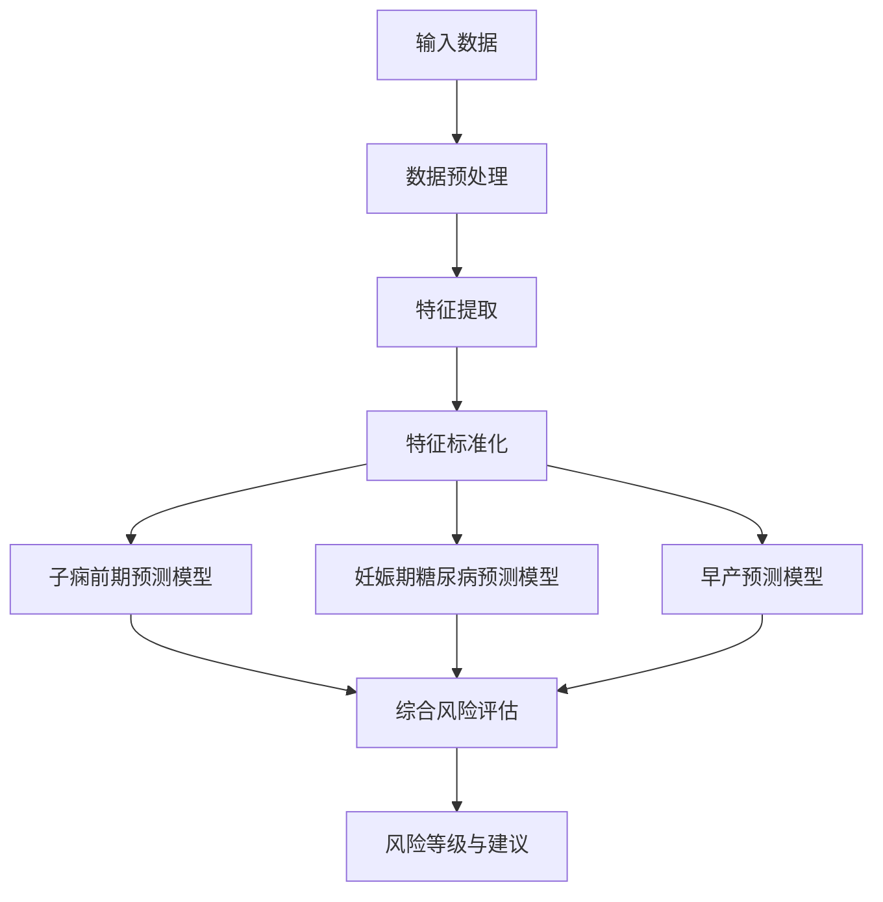

# 孕产妇风险预测算法总结

## 目录
1. [算法概述](#算法概述)
2. [基本原理](#基本原理)
3. [核心思想](#核心思想)
4. [实现步骤](#实现步骤)
5. [复杂度分析](#复杂度分析)
6. [适用场景](#适用场景)
7. [局限性](#局限性)
8. [代码示例](#代码示例)
9. [总结](#总结)

---

## 算法概述

孕产妇风险预测算法是一个基于机器学习的多分类预测系统，专门用于评估孕妇在妊娠期间可能面临的三种主要风险：子痫前期、妊娠期糖尿病和早产。该算法采用集成学习方法，结合多种机器学习模型，通过分析孕妇的临床数据和个人特征，提供个性化的风险评估和预防建议。

### 技术栈
- **编程语言**: Python
- **核心库**: scikit-learn, pandas, numpy, tensorflow/keras
- **机器学习模型**: 随机森林、梯度提升、逻辑回归、神经网络
- **数据处理**: StandardScaler, 特征工程
- **评估指标**: 准确率、AUC、分类报告

---

## 基本原理

### 1. 风险预测模型架构

该算法采用**多模型集成**架构，针对每种孕产妇风险（子痫前期、妊娠期糖尿病、早产）训练独立的预测模型，然后通过综合风险评估模块整合各模型的预测结果。



### 2. 数据特征工程

算法从原始数据中提取七类特征：

1. **基本特征**: 年龄、身高、体重、BMI
2. **孕周特征**: 孕周、孕周分类
3. **生命体征特征**: 收缩压、舒张压、心率
4. **实验室检查特征**: 血糖、血红蛋白等
5. **妊娠特征**: 胎次、产次、妊娠类型
6. **既往病史特征**: 高血压史、糖尿病史等
7. **风险因素特征**: 高龄、肥胖等

### 3. 模型选择与优化

算法采用**模型选择策略**，通过交叉验证比较多个候选模型的性能，选择表现最佳的模型：

- **随机森林**: 处理非线性关系，特征重要性评估
- **梯度提升**: 处理复杂模式，高预测精度
- **逻辑回归**: 简单可解释，基线模型
- **神经网络**: 处理高度非线性关系（可选）

---

## 核心思想

### 1. 多风险并行预测

不同于单一风险预测系统，该算法的核心思想是**并行预测多种孕产妇风险**，每种风险有专门的预测模型和特征工程，确保针对性和准确性。

### 2. 个性化风险评估

算法不仅提供风险概率，还通过**特征重要性分析**识别个体化的主要风险因素，并基于风险等级提供个性化的预防建议。

### 3. 动态风险等级划分

根据风险概率将风险划分为三个等级：
- **低风险**: 概率 < 0.4
- **中风险**: 0.4 ≤ 概率 < 0.7
- **高风险**: 概率 ≥ 0.7

### 4. 不平衡数据处理

针对医疗数据中常见的类别不平衡问题，算法采用**加权损失函数**和**分层采样**技术，提高对少数类（高风险）的识别能力。

---

## 实现步骤

### 1. 数据加载与预处理

```python
def load_maternal_data(self, data_path: str) -> pd.DataFrame:
    """
    加载孕产妇数据，支持CSV、JSON和SQLite格式
    """
    # 根据文件扩展名选择加载方法
    # 数据清洗和预处理
    # 返回标准化的DataFrame
```

### 2. 特征提取与工程

```python
def extract_maternal_features(self, df: pd.DataFrame) -> Tuple[np.ndarray, np.ndarray]:
    """
    提取孕产妇特征，包括七大类特征
    """
    # 基本特征提取
    # 孕周特征提取
    # 生命体征特征提取
    # 实验室检查特征提取
    # 妊娠特征提取
    # 既往病史特征提取
    # 风险因素特征提取
    
    # 返回特征矩阵和标签
```

### 3. 模型训练与评估

```python
def train_preeclampsia_model(self, df: pd.DataFrame) -> Dict[str, Any]:
    """
    训练子痫前期预测模型
    """
    # 准备数据
    X, y = self.prepare_preeclampsia_data(df)
    
    # 特征标准化
    scaler = StandardScaler()
    X_scaled = scaler.fit_transform(X)
    
    # 分割数据
    X_train, X_test, y_train, y_test = train_test_split(...)
    
    # 处理类别不平衡
    class_weights = compute_class_weight(...)
    
    # 训练多个模型并选择最佳
    models = {
        'random_forest': RandomForestClassifier(...),
        'gradient_boosting': GradientBoostingClassifier(...),
        'logistic_regression': LogisticRegression(...)
    }
    
    # 交叉验证选择最佳模型
    # 训练最佳模型
    # 评估模型性能
    # 保存模型和预处理器
```

### 4. 风险预测与结果生成

```python
def predict_comprehensive_risk(self, patient_data: Dict[str, Any]) -> Dict[str, Any]:
    """
    综合风险评估
    """
    # 预测各类风险
    preeclampsia_result = self.predict_preeclampsia_risk(patient_data)
    gestational_diabetes_result = self.predict_gestational_diabetes_risk(patient_data)
    preterm_birth_result = self.predict_preterm_birth_risk(patient_data)
    
    # 计算综合风险评分
    risk_scores = [...]
    overall_risk = np.mean(risk_scores)
    
    # 确定风险等级
    if overall_risk >= 0.7:
        risk_level = '高风险'
    elif overall_risk >= 0.4:
        risk_level = '中风险'
    else:
        risk_level = '低风险'
    
    # 生成个性化建议
    recommendations = self.get_comprehensive_recommendations(risk_level, overall_risk)
    
    # 返回综合结果
```

---

## 复杂度分析

### 1. 时间复杂度

#### 训练阶段
- **随机森林**: O(n * m * d * log n)，其中n是样本数，m是树的数量，d是特征维度
- **梯度提升**: O(n * m * d)，其中n是样本数，m是迭代次数，d是特征维度
- **逻辑回归**: O(n * d * k)，其中n是样本数，d是特征维度，k是迭代次数

#### 预测阶段
- **随机森林**: O(m * log n)，其中m是树的数量，n是叶子节点数
- **梯度提升**: O(m)，其中m是树的数量
- **逻辑回归**: O(d)，其中d是特征维度

### 2. 空间复杂度

#### 训练阶段
- **随机森林**: O(m * n)，其中m是树的数量，n是节点数
- **梯度提升**: O(m * n)，其中m是树的数量，n是节点数
- **逻辑回归**: O(d)，其中d是特征维度

#### 预测阶段
- **随机森林**: O(m * n)，其中m是树的数量，n是节点数
- **梯度提升**: O(m * n)，其中m是树的数量，n是节点数
- **逻辑回归**: O(d)，其中d是特征维度

### 3. 优化策略

1. **特征选择**: 通过特征重要性分析减少冗余特征
2. **模型压缩**: 使用剪枝技术减少随机森林和梯度提升的树大小
3. **模型并行**: 利用多核CPU并行训练和预测
4. **增量学习**: 支持新数据的增量更新，避免全量重训

---

## 适用场景

### 1. 临床应用场景

- **产前检查**: 在常规产检中评估孕妇风险，指导个性化管理
- **高危筛查**: 快速识别高风险孕妇，提供针对性干预
- **远程监护**: 结合可穿戴设备数据，实现居家风险评估
- **医疗资源分配**: 根据风险等级合理分配医疗资源

### 2. 数据要求

- **最小数据集**: 年龄、身高、体重、孕周、血压、血糖等基本指标
- **完整数据集**: 包括实验室检查、既往病史、家族史等全面信息
- **数据质量**: 数据应经过清洗和标准化处理，缺失值应合理填充

### 3. 系统集成

- **电子病历系统**: 与医院EMR系统集成，自动获取患者数据
- **移动健康应用**: 集成到孕妇健康管理APP中
- **远程医疗平台**: 作为远程医疗服务的风险评估模块

---

## 局限性

### 1. 数据局限性

- **数据偏差**: 训练数据可能存在地域、种族或社会经济偏差
- **样本量限制**: 罕见并发症的训练样本可能不足
- **数据质量**: 依赖高质量的临床数据，缺失值和异常值影响预测精度

### 2. 模型局限性

- **泛化能力**: 在与训练数据分布不同的新数据上性能可能下降
- **动态变化**: 无法捕捉孕妇状态的快速变化
- **复杂交互**: 可能遗漏多因素间的复杂交互作用

### 3. 应用局限性

- **解释性**: 黑盒模型（如神经网络）的可解释性有限
- **实时性**: 复杂模型的预测延迟可能影响实时应用
- **法规限制**: 医疗AI应用的法规和伦理限制

### 4. 改进方向

1. **联邦学习**: 在保护隐私的前提下利用多中心数据
2. **迁移学习**: 利用大规模医疗数据预训练，小数据微调
3. **多模态融合**: 结合影像、基因等多模态数据
4. **时序建模**: 考虑孕妇状态的时序变化，使用LSTM/Transformer等模型

---

## 代码示例

### 1. 预测器初始化与模型训练

```python
# 创建预测器
predictor = MaternalRiskPredictor(model_dir="models")

# 训练所有模型
results = predictor.train_all_models(data_path="data/maternal_data.csv")

# 查看训练结果
print("子痫前期模型:", results['preeclampsia'])
print("妊娠期糖尿病模型:", results['gestational_diabetes'])
print("早产模型:", results['preterm_birth'])
```

### 2. 单一风险预测

```python
# 示例患者数据
patient_data = {
    'age': 32,
    'height': 165,
    'weight': 70,
    'gestational_weeks': 28,
    'parity': 1,
    'pregnancy_count': 2,
    'systolic_pressure': 135,
    'diastolic_pressure': 85,
    'blood_sugar': 6.5,
    'pregnancy_type': '单胎',
    'risk_factors': '高龄,肥胖'
}

# 预测子痫前期风险
preeclampsia_result = predictor.predict_preeclampsia_risk(patient_data)
print("子痫前期风险:", preeclampsia_result['risk_level'])
print("风险概率:", preeclampsia_result['risk_probability'])
print("主要风险因素:", preeclampsia_result['top_risk_factors'])
print("预防建议:", preeclampsia_result['recommendations'])
```

### 3. 综合风险评估

```python
# 预测综合风险
comprehensive_result = predictor.predict_comprehensive_risk(patient_data)

print("综合风险等级:", comprehensive_result['overall_risk_level'])
print("综合风险评分:", comprehensive_result['overall_risk_score'])
print("主要风险因素:", comprehensive_result['top_risk_factors'])
print("综合建议:", comprehensive_result['recommendations'])

# 各类风险详情
print("子痫前期风险:", comprehensive_result['individual_risks']['preeclampsia']['risk_level'])
print("妊娠期糖尿病风险:", comprehensive_result['individual_risks']['gestational_diabetes']['risk_level'])
print("早产风险:", comprehensive_result['individual_risks']['preterm_birth']['risk_level'])
```

### 4. 模型性能评估

```python
# 获取模型性能指标
def evaluate_model_performance(results):
    for risk_type, result in results.items():
        if result:
            print(f"{risk_type} 模型性能:")
            print(f"  模型类型: {result['model_name']}")
            print(f"  准确率: {result['accuracy']:.4f}")
            print(f"  AUC: {result['auc']:.4f}")
            
            # 分类报告
            report = result['classification_report']
            print(f"  精确率(高风险): {report['1']['precision']:.4f}")
            print(f"  召回率(高风险): {report['1']['recall']:.4f}")
            print(f"  F1分数(高风险): {report['1']['f1-score']:.4f}")

# 评估模型性能
evaluate_model_performance(results)
```

---

## 总结

孕产妇风险预测算法是一个基于机器学习的多分类预测系统，通过分析孕妇的临床数据和个人特征，评估子痫前期、妊娠期糖尿病和早产的风险。该算法采用多模型集成架构，结合特征工程和模型选择技术，提供个性化的风险评估和预防建议。

### 主要优势

1. **多风险并行预测**: 同时评估多种孕产妇风险，提供全面风险评估
2. **个性化分析**: 通过特征重要性分析识别个体化的主要风险因素
3. **模型自适应**: 通过交叉验证自动选择最佳模型，适应不同数据分布
4. **不平衡数据处理**: 采用加权损失函数和分层采样技术，提高对少数类的识别能力

### 应用价值

1. **临床决策支持**: 为医护人员提供客观的风险评估，辅助临床决策
2. **个性化管理**: 根据风险等级制定个性化的产检和干预方案
3. **医疗资源优化**: 合理分配医疗资源，优先关注高风险孕妇
4. **健康教育**: 提供针对性的健康教育，提高孕妇自我管理能力

### 未来发展方向

1. **多模态数据融合**: 结合影像、基因等多模态数据，提高预测精度
2. **时序建模**: 考虑孕妇状态的时序变化，捕捉风险动态演变
3. **联邦学习**: 在保护隐私的前提下利用多中心数据，提高模型泛化能力
4. **可解释性增强**: 提高模型的可解释性，增强医护人员和患者的信任度

孕产妇风险预测算法作为医疗AI的重要应用，有望在提高孕产妇保健水平、降低妊娠并发症发生率方面发挥重要作用，为实现个性化精准医疗提供技术支持。